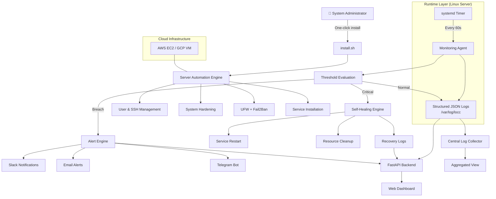

# LinuxOps Control Center (LOCC)

## Overview

LinuxOps Control Center (LOCC) is a production-style Linux infrastructure automation and monitoring platform designed to provision, secure, monitor, alert, and self-heal Linux servers with minimal manual intervention.

This project simulates real-world DevOps / SRE tooling used inside engineering teams to manage Linux servers reliably and at scale.

LOCC is self-hosted, lightweight, and built using core Linux administration principles, making it ideal for learning and demonstrating Linux, DevOps, and Infrastructure Engineering skills.

---

## Problem Statement

In many environments, Linux servers are:

- Manually configured, leading to inconsistencies  
- Poorly monitored, causing late failure detection  
- Dependent on heavy or expensive third-party monitoring tools  
- Lacking automated recovery mechanisms  
- Missing centralized visibility into system health and security events  

These issues result in downtime, operational risk, and slow incident response.

---

## Solution

LinuxOps Control Center (LOCC) addresses these challenges by providing:

- One-click automated server provisioning  
- Continuous system monitoring using a custom agent  
- Real-time alerting via Slack / Email  
- Automated self-healing for common failures  
- Centralized logs and a web-based dashboard  
- Cloud-ready deployment (AWS / GCP / VPS)  

All components are built using open-source tools and native Linux utilities, emphasizing reliability, observability, and automation.

---

## Core Components

### 1. Server Automation Engine (Implemented)

A fully automated, **config-driven Linux provisioning engine** that converts a fresh Ubuntu server into a secure, production-ready node.

#### Features:
- Config-driven automation via `locc.conf` (template committed, env-specific config ignored)
- Secure admin user creation with sudo access
- SSH hardening with public-key authentication (no passwords)
- Automatic SSH public key injection
- Configurable SSH port
- UFW firewall with default deny policy
- Fail2Ban for brute-force protection
- Optional base service installation (Nginx)
- Centralized execution logs at `/var/log/locc/automation.log`
- Fully idempotent (safe to re-run)

Provisioning is performed using a single command:
```bash
sudo bash automation/install.sh
```


---

 ### 2. Monitoring Agent (Implemented)
 
 A custom-built **Linux monitoring agent** managed by `systemd` timers that runs every 60 seconds and emits **structured JSON metrics**.
 
 #### Capabilities:
 - CPU usage and load averages
 - Memory usage and utilization percentage
 - Disk and inode usage (root filesystem)
 - Top CPU- and memory-consuming processes
 - Service health monitoring (`ssh`, `nginx`, `fail2ban`, `ufw`)
 - System metadata (hostname, uptime, agent version)
 
 #### Design Highlights:
 - Runs as a hardened `systemd` oneshot service
 - Scheduled via `systemd` timer (no cron)
 - Stateless execution (one run = one JSON object)
 - Append-only JSONL logs written to `/var/log/locc/agent.json`
 - Fault-tolerant metric collection (missing metrics do not crash the agent)
 
 The monitoring agent acts as the **data source** for alerting, self-healing, and dashboard layers in subsequent phases.
 

---

### 3. Alerting System (Implemented)

A **state-aware, threshold-based alerting engine** that evaluates structured monitoring data and detects abnormal system conditions in real time.

#### Alert Conditions
The alerting system currently triggers alerts for:

- High CPU usage
- High memory usage
- High disk usage
- High inode usage
- Critical service failures:
  - `ssh`
  - `nginx`
  - `fail2ban`
  - `ufw`

Alerts are **edge-triggered**, meaning they fire only on state transitions (OK → ALERT) and include **recovery notifications** (ALERT → RECOVERED) to prevent alert fatigue.

#### Design Highlights
- Reads monitoring data from `/var/log/locc/agent.json`
- Config-driven thresholds via `thresholds.conf`
- Persistent alert state tracking to avoid duplicate alerts
- Explicit ALERT and RECOVERED lifecycle handling
- Structured alert logging for auditability

#### Notification Channels
Alerts are currently delivered via:

- **Slack** (Incoming Webhooks)

> Email and Telegram integrations are intentionally deferred to future phases to keep the alerting core focused and reliable.

The alerting system is designed to integrate seamlessly with the upcoming **self-healing engine** while maintaining clear separation of concerns.


---

### 4. Self-Healing Engine

Automatically:

- Restarts failed services  
- Kills rogue processes  
- Cleans disk space  
- Rotates logs  
- Recovers from common failure states  

---

### 5. Web Dashboard

Provides:

- Real-time system metrics  
- Service status  
- Alert history  
- Security events  
- Log visibility  

---

## High-Level Architecture


---

## Tech Stack


---

## Project Structure

```
linuxops-control-center/
├── automation/          # Server provisioning scripts
├── monitoring-agent/    # Monitoring agent & systemd units
├── alerting/            # Alert dispatchers
├── self-healing/        # Recovery and remediation scripts
├── dashboard/           # Web dashboard (API + UI)
├── docs/                # Architecture & documentation
├── logs/                # Local log storage (ignored in git)
├── install.sh           # One-click installer
├── README.md
└── LICENSE
```

---

## Project Status

**Completed:** Phase 2 – Server Automation Engine  
**Completed:** Phase 3 – Monitoring Agent (systemd-based)  
**In Progress:** Phase 4 – Alerting Engine

The project now includes a production-ready Linux provisioning system and a fully functional systemd-managed monitoring agent emitting structured JSON metrics.


---

## Learning Outcomes

This project demonstrates practical knowledge of:

- Linux system administration  
- Bash automation  
- Monitoring and observability  
- Alerting and incident response  
- Reliability engineering (self-healing)  
- System design and documentation  
- Cloud-based Linux deployments  

---

## Use Cases

- Personal Linux infrastructure lab  
- DevOps / SRE portfolio project  
- Learning Linux automation and monitoring  
- Demonstrating production-style system design  

---

## License

This project is licensed under the MIT License.

