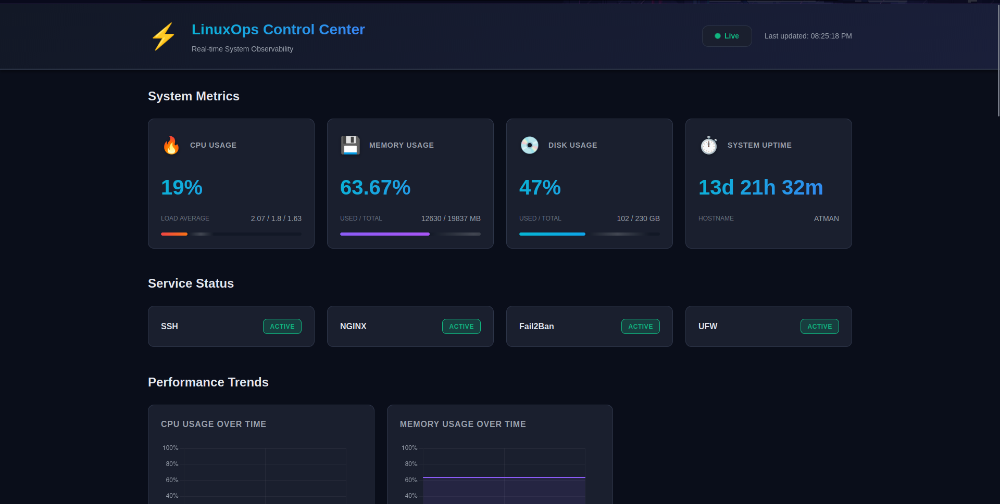
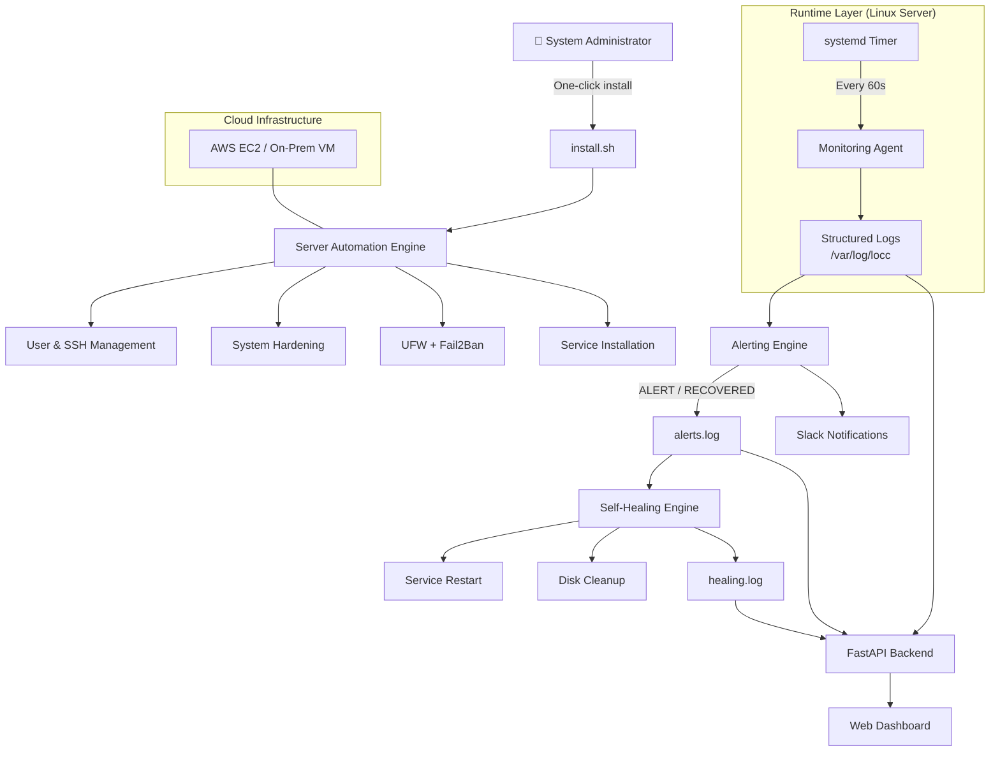

# LinuxOps Control Center (LOCC)

## Overview

**LinuxOps Control Center (LOCC)** is a **production-style Linux infrastructure automation and observability platform** designed to **provision, secure, monitor, alert, self-heal, and visualize Linux servers** with minimal manual intervention.

The project simulates **real-world DevOps / SRE tooling** used to operate Linux servers reliably, focusing on **native Linux primitives** (`systemd`, Bash, logs) rather than heavyweight third-party platforms.

LOCC is **lightweight, self-hosted, cloud-ready**, and built to demonstrate **practical Linux, DevOps, and Reliability Engineering skills**.

---

## Problem Statement

In many environments, Linux servers are:

- Manually configured, causing **drift and inconsistency**
- Poorly monitored, leading to **late failure detection**
- Dependent on **heavy or expensive monitoring stacks**
- Lacking **automated remediation**
- Missing a **clear, centralized view of system health**

These issues increase **downtime**, **operational risk**, and **incident response time**.

---

## Solution

**LinuxOps Control Center** addresses these problems by providing:

- **One-click automated server provisioning**
- **Continuous system monitoring** via a custom agent
- **Event-driven alerting** with recovery awareness
- **Safe, rule-based self-healing**
- A **read-only, real-time web dashboard**
- **Dockerized visualization layer** with host-safe access

All components are built using **open-source tools and native Linux utilities**, emphasizing **clarity, safety, and observability**.

---

## Core Components

### 1. Server Automation Engine *(Implemented)*

A **config-driven Linux provisioning engine** that converts a fresh Ubuntu server into a **secure, production-ready node**.

#### Features

- Config-driven execution via `locc.conf`
- Secure admin user creation with sudo access
- SSH hardening (key-only authentication, configurable port)
- Automatic SSH public key injection
- UFW firewall with default deny policy
- Fail2Ban for brute-force protection
- Optional base service installation (NGINX)
- Centralized logs at `/var/log/locc/automation.log`
- Fully **idempotent** (safe to re-run)

#### Usage 
```bash
sudo bash automation/install.sh
```

--- 

### 2. Monitoring Agent *(Implemented)*

A **custom Linux monitoring agent** managed by **systemd timers** that runs every **60 seconds** and emits **structured JSON metrics**.

#### Collected Metrics

- CPU usage and load averages
- Memory usage and utilization
- Disk and inode usage (root filesystem)
- Top CPU and memory consuming processes
- Service health (`ssh`, `nginx`, `fail2ban`, `ufw`)
- System metadata (hostname, uptime, agent version)

#### Design Highlights

- `systemd`-managed **oneshot execution**
- **Timer-based scheduling** (no cron)
- **Stateless execution model**
- **Append-only JSONL output**
- **Fault-tolerant metric collection**

#### Output

```bash
/var/log/locc/agent.json
```
This agent acts as the single source of truth for alerting, self-healing, and visualization.

---

### 3. Alerting Engine *(Implemented)*

A **state-aware, event-driven alerting system** that evaluates monitoring data and detects abnormal conditions.

#### Alert Types

- High CPU usage
- High memory usage
- High disk usage
- High inode usage
- Critical service failures (`ssh`, `nginx`, `fail2ban`, `ufw`)

#### Alert Lifecycle

- **`ALERT`** → condition breached  
- **`RECOVERED`** → condition resolved  
- **`*_RECOVERY_FAILED`** → automated remediation failed  

Alerts are **edge-triggered**, preventing alert fatigue and repeated notifications.

#### Design Highlights

- Reads from `/var/log/locc/agent.json`
- Thresholds defined in `thresholds.conf`
- Persistent state tracking (`state.db`)
- Structured, machine-parseable logs
- Clean separation from remediation logic

#### Notifications

- **Slack** (Incoming Webhooks)

---

### 4. Self-Healing Engine *(Implemented)*

A **rule-based, alert-driven remediation engine** that safely attempts recovery actions **only when alerts occur**.

#### Supported Actions

- Automatic restart of failed services
- Guarded disk cleanup for high disk usage
- Cooldown-protected execution
- Explicit escalation on recovery failure

#### Safety Principles

- No direct metric polling
- No blind loops
- Rule-controlled enablement
- Audit-logged actions
- `systemd`-managed execution

#### Logs

```bash
/var/log/locc/healing.log
```

---

### 5. Web Dashboard *(Implemented)*

A **read-only, real-time observability dashboard** that visualizes **system health, alerts, and self-healing activity**.

#### Webpage Overview


#### Features

- Live CPU, memory, disk, and uptime metrics
- Service status indicators
- Real-time charts (CPU / Memory / Disk)
- Alert history with state-based coloring
- Self-healing activity log (terminal-style)
- Responsive, dark **DevOps-style UI**

#### Architecture

- **FastAPI** backend (log readers)
- Pure **HTML / CSS / JavaScript** frontend
- **Chart.js** via CDN
- No frameworks, no build tools
- **Dockerized** for safe deployment

#### Docker Deployment

```bash
cd dashboard
docker compose up --build
```

The container mounts `/var/log/locc` read-only, ensuring zero host control.

## High-Level Architecture


## Tech Stack


### Project Structure
```
linuxops-control-center/
├── automation/
├── monitoring-agent/
├── alerting/
├── self-healing/
├── dashboard/
├── docs/
├── logs/
├── README.md
└── LICENSE.md
```

## Project Status

**Completed**

- Server Automation Engine  
- Monitoring Agent  
- Alerting Engine  
- Self-Healing Engine  
- Web Dashboard  
- Dockerized Visualization Layer  

This project represents a **complete, end-to-end autonomous Linux operations platform**.

---

## Learning Outcomes

This project demonstrates hands-on experience with:

- Linux system administration
- Bash automation
- `systemd` services and timers
- Observability and monitoring
- Event-driven alerting
- Safe self-healing design
- Dockerized service deployment
- Production-style system architecture

---

## Use Cases

- **DevOps / SRE portfolio project**
- **Personal Linux infrastructure lab**
- **Learning production Linux operations**
- **Demonstrating real-world system design**
