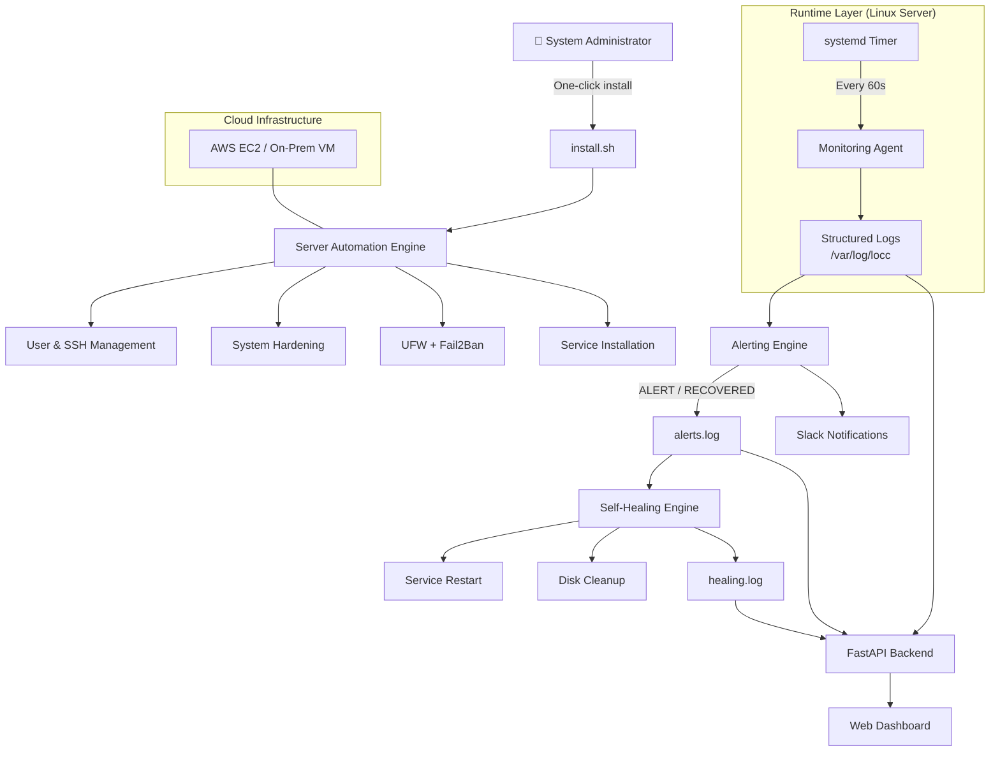

# Architecture Overview

## High-Level Flow

## Component Responsibilities
- Automation Engine
- Monitoring Agent
- Alerting Engine
- Self-Healing Engine
- Dashboard

## Design Principles
- Alert-driven healing
- systemd over cron
- Read-only observability
