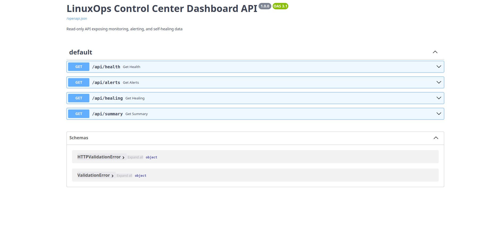
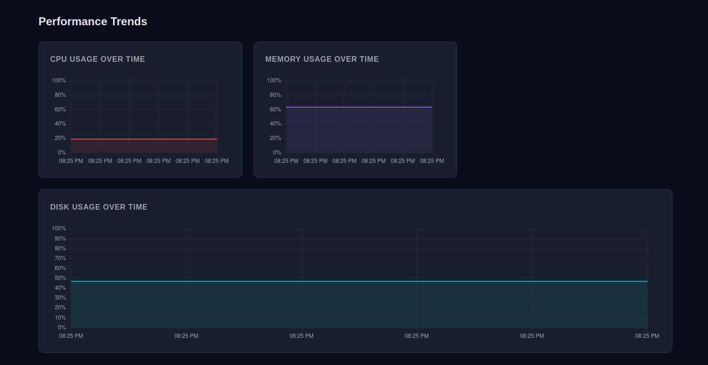
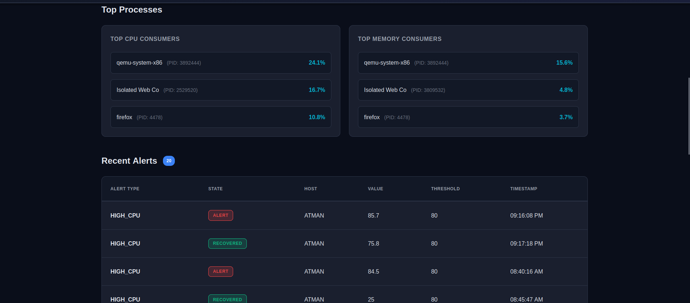

# Dashboard Design

The LOCC dashboard provides a real-time, read-only view of system health, alerts, and self-healing activity.

It is intentionally designed as a **visualization layer only**.

---

## Design Principles

- Read-only access
- No system control from UI
- Real data from real logs
- Minimal dependencies
- Safe to deploy on production systems

---

## Architecture

The dashboard consists of two components:

1. **Backend**
   - FastAPI application
   - Reads system logs
   - Exposes read-only APIs

2. **Frontend**
   - Static HTML, CSS, JavaScript
   - No frameworks
   - Chart.js via CDN

---

## Why Read-Only?

Allowing dashboards to control systems:
- Increases blast radius
- Creates security risks
- Encourages unsafe operations

LOCC intentionally separates:
- **Decision-making** → backend automation
- **Visualization** → dashboard

---

## Dockerization Strategy

Only the dashboard is containerized.

Reasons:
- Stateless
- No system access required
- Easy to deploy and remove

The container mounts logs as **read-only**:

```bash
/var/log/locc:/var/log/locc:ro
```


This guarantees:
- No host modification
- No privilege escalation
- No control paths from UI

---

## UI Features

- Live CPU, memory, disk metrics
- Real-time charts
- Service status indicators
- Alert history
- Self-healing activity log
- Responsive dark-themed layout

---

## Dashboard Screenshots

### Overview


### FastAPI Backend


### Charts


### Top Processer and Alerts

--- 

## Security Considerations

- No privileged containers
- No authentication required (local demo)
- No write access to host
- No execution of system commands

---

## Summary

The dashboard complements LOCC by making automation observable while preserving strict operational boundaries.
